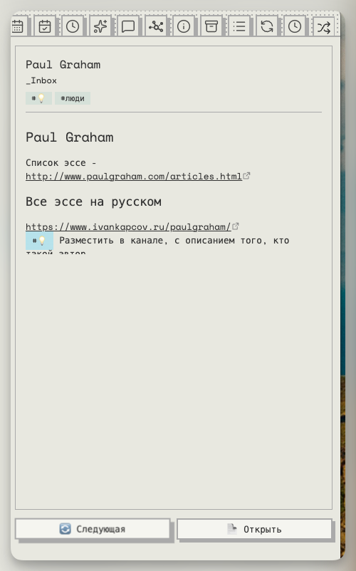
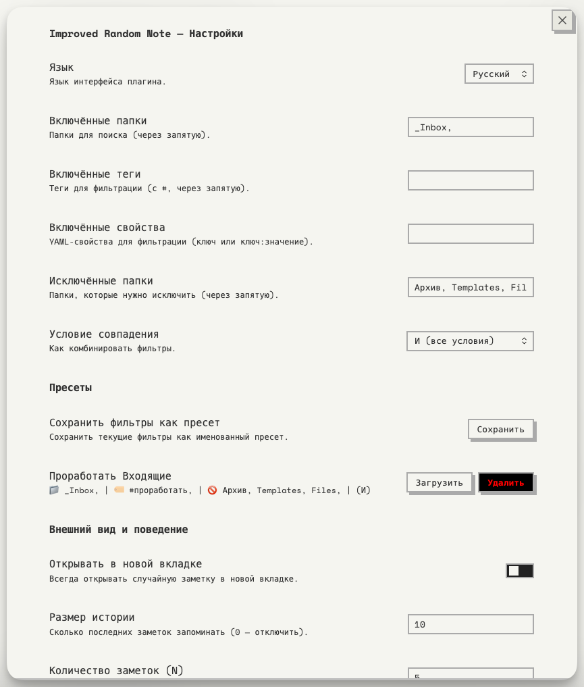
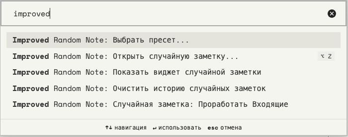

# Improved Random Note

<div align="center">
  
</div>

An [Obsidian](https://obsidian.md) plugin that opens a random note based on customizable filters. Go beyond simple randomness — focus on the notes that matter to you.

## ✨ Features

### 🎯 Smart Filters
- **Include folders** — search only in specific folders
- **Include tags** — filter by tags (frontmatter and inline)
- **Include properties** — filter by YAML frontmatter properties (key or key:value)
- **Exclude folders** — skip folders like templates or archives
- **Match condition** — combine filters with AND (all must match) or OR (any can match)

### 📚 Filter Presets
- Save your current filters as **named presets** (e.g., "Books", "Projects", "Daily Notes")
- Each preset gets its own **command in the palette** (Cmd/Ctrl+P)
- **Fuzzy search** modal for quickly picking a preset
- Load any preset back into settings, or delete it

### 📜 History
- Remembers the last N opened notes to **avoid duplicates**
- Configurable history size (default: 5, set to 0 to disable)
- Auto-resets when all candidates have been shown
- Clear history from settings or via command

### 📌 Sidebar Widget
- A dedicated **sidebar panel** with a random note preview
- Shows: note title, folder path, tags, and a **rendered markdown excerpt**
- **Refresh** to see another note or **Open** to navigate to it
- Access via command: *Show random note widget*

### ⚙️ General
- Open notes in the **current tab** or always in a **new tab**
- Works with the **ribbon icon** (🔀), commands, presets, or the sidebar

## 📸 Screenshots





## 🚀 Installation

### From Obsidian Community Plugins (coming soon)
1. Open **Settings → Community plugins → Browse**
2. Search for **"Improved Random Note"**
3. Click **Install**, then **Enable**

### Manual Installation
1. Download `main.js`, `manifest.json`, and `styles.css` from the [latest release](https://github.com/dementiy/obsidian-improved-random-note/releases)
2. Create a folder: `.obsidian/plugins/improved-random-note/`
3. Copy the three files into that folder
4. Restart Obsidian and enable the plugin in **Settings → Community plugins**

## 🛠 Development

```bash
# Clone the repo into your vault's plugins folder
cd /path/to/vault/.obsidian/plugins/
git clone https://github.com/dementiy/obsidian-improved-random-note.git
cd obsidian-improved-random-note

# Install dependencies
npm install

# Build
npm run build

# Watch mode (auto-rebuild on changes)
npm run dev
```

## 📄 License

[MIT](LICENSE)
